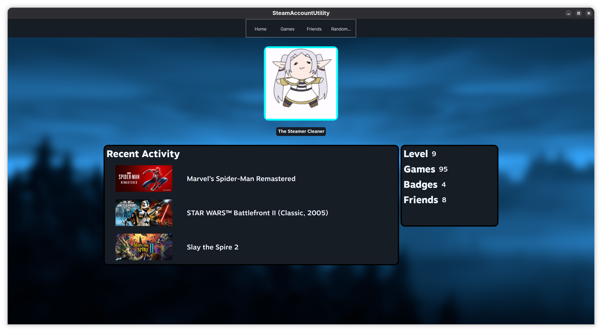
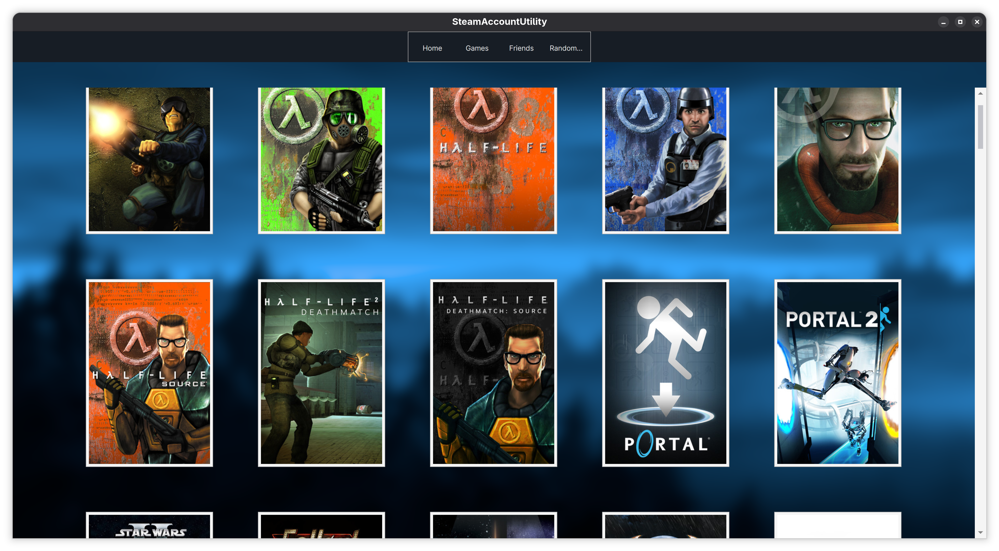
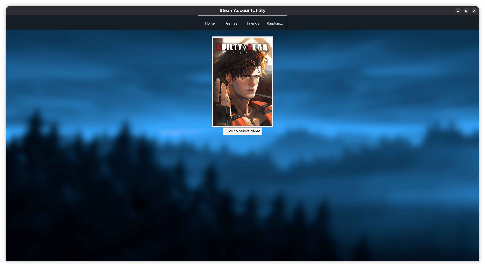

# STEAM ACCOUNT UTILITY

A fun little app to display Steam stats of a user as well as
any fun features I can think of, such as a game randomizer for those who
never play any other games yet still buy them in Steam sales (you know who you are).
If you got any other recommendations, let me know!

## Technologies and Languages
- **C#:** The programming language used throughout this project
- **Avalonia:** The basis of the C# UI app, providing various tools and libraries for app development -> https://github.com/AvaloniaUI/Avalonia
- **SteamKit:** A .NET library that interoperates with Steam's own network -> https://github.com/SteamRE/SteamKit

## Licensing
Steam Account Utility is released under the GPL-3.0 license.

## Credits
I would like to credit the following users and groups for making this fun project possible:
- **Valve** for the amazing Steam game platform that inspired to make a project revolving around it in the first place -> https://www.valvesoftware.com/en/about
- **The Avalonia group** for providing to the community an open source C# UI framework project that I can use here -> https://avaloniaui.net/
- **The SteamRE group** for creating the SteamKit library that helped me tremendously to interact with Steam in C# without losing hairballs -> https://github.com/SteamRE/SteamKit
- **Deadpikle** for the progress rings that I use in my loading screens -> https://github.com/Deadpikle/AvaloniaProgressRing
- **hrantzsch** for the KeyChain library that I use to save secrets for my project -> https://github.com/hrantzsch/keychain
- **goaaats** for the C# implementation of the KeyChain project -> https://github.com/goaaats/KeySharp
- **OppOops** for an improved fork of goaaats' project -> https://github.com/OppOops/keyring-dotnet
- **davidxuang** for packaging FluentUI icons to be used in Avalonia -> https://github.com/davidxuang/FluentIcons
- **Microsoft** for providing the  Fluent Icons themselves -> https://github.com/microsoft/fluentui-system-icons